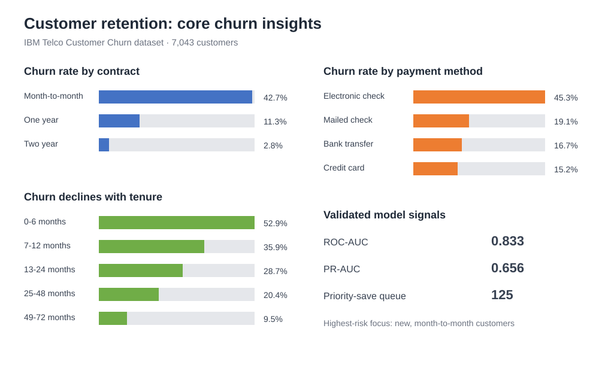

# Customer Retention Decision Engine

I built this project to understand which telecom customers are most likely to churn and how a retention team could decide where to focus its limited outreach capacity.

The work uses the IBM Telco Customer Churn dataset. I treated the project as both an analytics exercise and a small production-style Python package: the notebook tells the story, while the reusable logic lives in `src/retention_engine/` and is covered by tests.

## What I built

- Cleaned the source data and handled numeric and categorical features consistently.
- Excluded identifiers and target-derived fields such as `Churn Value`, `Churn Score`, `CLTV`, and `Churn Reason` to avoid leakage.
- Built a scikit-learn preprocessing and logistic-regression pipeline.
- Evaluated the model with ROC-AUC and PR-AUC rather than relying on accuracy alone.
- Converted churn probabilities into explainable retention actions using customer value and contact cost.
- Added a capacity-aware queue so the highest-value eligible customers can be prioritized.
- Added segment summaries, data-quality checks, score monitoring, notebook validation, automated tests, and GitHub Actions CI.

## Results

In the notebook validation run, the pipeline processed a stratified 3,000-customer sample and achieved:

- ROC-AUC: `0.833`
- PR-AUC: `0.656`
- 125 customers classified for the priority-save queue

## Core insights



The clearest patterns were higher churn among month-to-month customers, electronic-check users, and customers in their first six months. I use these as signals for further investigation and targeted retention testing, not as proof that any single factor causes churn.

## Run it locally

```bash
python -m venv .venv
source .venv/bin/activate  # Windows: .venv\Scripts\activate
pip install -r requirements.txt
PYTHONPATH=src pytest -q
```

Place the IBM Telco Customer Churn workbook at `data/raw/Telco_customer_churn.xlsx`, or update the path in the notebook scripts. The raw dataset is intentionally excluded from GitHub.

To reproduce the validation and charts from Jupyter:

```python
%run notebooks/retention_engine_validation.py
%run notebooks/core_insights.py
```

## Repository structure

```text
customer-retention-decision-engine/
├── assets/                   # README visualization
├── docs/                     # analytical and delivery notes
├── notebooks/                # validation and visualization scripts
├── src/retention_engine/     # reusable Python package
├── tests/                    # automated tests
├── requirements.txt
└── README.md
```

## Skills demonstrated

Python, pandas, NumPy, scikit-learn, feature engineering, model evaluation, testing, data-quality analysis, monitoring summaries, explainable decision rules, and business-focused analytics.

## Responsible use

This is a decision-support prototype, not an autonomous customer-action system. Before production use, I would add model versioning, access controls, drift thresholds, fairness review, consent checks, and uplift experiments to measure whether an intervention actually improves retention.
